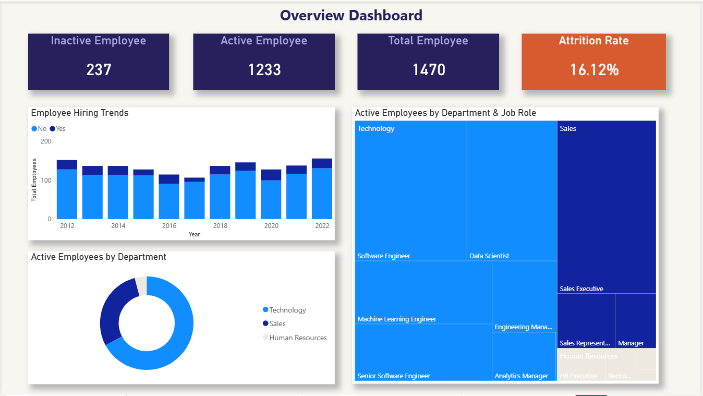
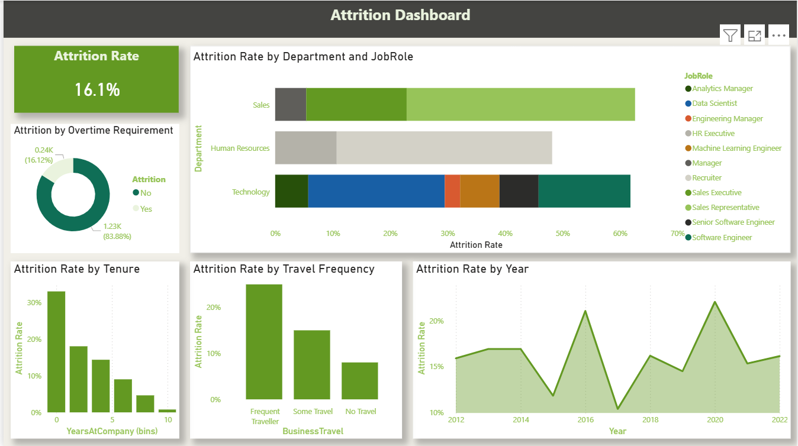
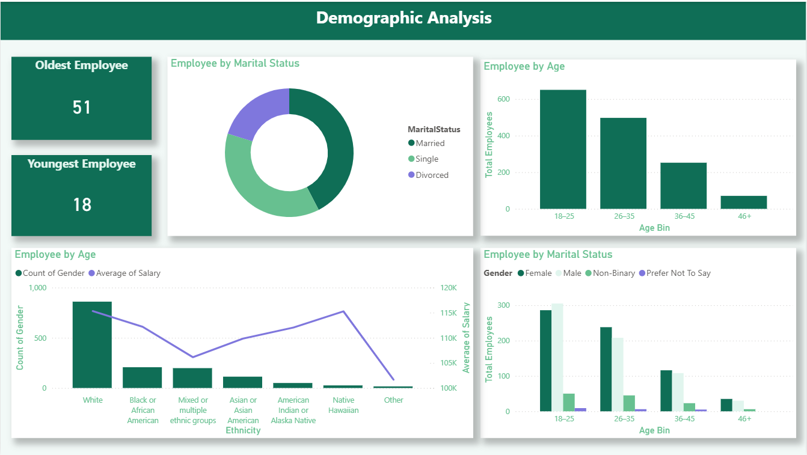
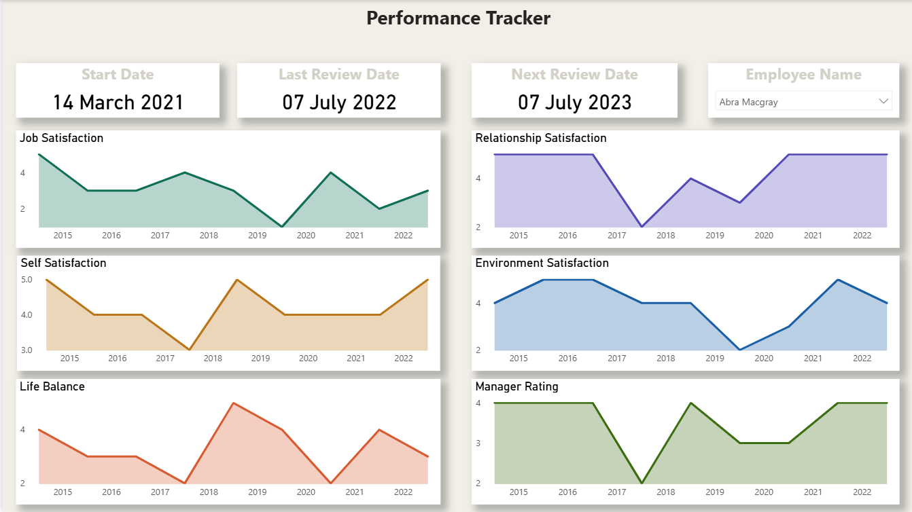

# Atlas HR Analytics Dashboard

## Overview
An end-to-end HR Analytics Dashboard built in Power BI to analyze workforce data from Atlas company. The project covers the full data pipeline — from raw CSV ingestion and cleaning in Power Query, to data modeling, DAX measures, and interactive visualizations — enabling data-driven HR decision-making.

---

## Tools & Technologies
- **Microsoft Power BI** — dashboard development and Power BI Service
- **Power Query (M language)** — data ingestion, cleansing, and transformation
- **DAX** — calculated columns, measures, and KPIs
- **CSV datasets** — raw HR workforce data

---

## Data Pipeline
1. **Data Collection** — Imported raw HR dataset (CSV) into Power BI via Power Query
2. **Data Cleansing** — Removed duplicates, handled null values, standardized column formats and data types
3. **Data Transformation** — Created calculated columns for tenure buckets, age groups, and attrition flags
4. **Data Modeling** — Built relationships between tables to enable cross-filtering across departments, roles, and demographics
5. **DAX Measures** — Developed measures for Attrition Rate, Active/Inactive headcount, satisfaction averages, and performance scores
6. **Visualization** — Designed interactive report pages with slicers, KPI cards, bar charts, and demographic breakdowns

---

## Key KPIs
| Metric | Value |
|---|---|
| Total Employees | 1,470 |
| Active Employees | 1,233 |
| Inactive Employees | 237 |
| Attrition Rate | 16.12% |

---

## Key Insights
- Attrition is highest among employees with low tenure (under 2 years)
- Frequent business travel is linked to increased attrition risk
- Majority of the workforce falls in the 18–35 age group
- Technology and Sales departments dominate employee distribution
- Satisfaction scores show a strong correlation with attrition likelihood

---

## Business Recommendations
- Strengthen onboarding programs to reduce early-stage attrition
- Address work-life balance concerns for frequent travelers
- Monitor satisfaction metrics periodically to identify at-risk employees
- Focus retention efforts on high-attrition departments and roles

---

## Project Structure

- **Dashboard/** — Power BI (.pbix) file and dashboard screenshots
- **Data/** — Raw CSV dataset
- **report/** — Dashboard PDF export
  
---

## Dashboard Preview

### Overview

### Attrition Analysis

### Demographic Analysis

### Performance Tracker

